# CampFit Database ERD

현재 레포의 Supabase DDL 기준 ERD입니다.

- 기준 파일: `supabase/campfit.sql`
- 기준 마이그레이션: `supabase/migrations/202607070001_campfit_v2_schema.sql`
- 품질 데이터 마이그레이션: `supabase/migrations/202607110001_add_program_quality_foundation.sql`
- `auth.users`, `programs`, `partners`는 외부 또는 기존 테이블로 표시했습니다.

```mermaid
erDiagram
  AUTH_USERS {
    uuid id PK
  }

  CAMPFIT_SESSIONS {
    bigint id PK
    text session_id UK
    jsonb parent_input
    jsonb structured_profile
    jsonb camp_readiness_check
    jsonb follow_up_answers
    jsonb recommended_camps
    boolean consultation_requested
    timestamptz created_at
  }

  CAMPFIT_FEEDBACK {
    bigint id PK
    text session_id
    text feedback
    text clicked_camp
    timestamptz created_at
  }

  CAMPFIT_V2_SESSIONS {
    uuid id PK
    uuid user_id FK
    text anonymous_session_id
    text status
    text current_step
    timestamptz created_at
    timestamptz updated_at
  }

  CAMPFIT_V2_REQUIRED_INTAKES {
    uuid id PK
    uuid session_id FK
    integer child_age_at_start
    text departure_window
    integer duration_weeks_min
    integer duration_weeks_max
    integer total_budget_all_in_krw_min
    integer total_budget_all_in_krw_max
    text budget_scope
    integer child_count
    integer parent_count
    integer sibling_count
    text preferred_region_groups
    text region_priority
    text parent_accompaniment_mode
    text korean_support_need
    text accommodation_preferences
    jsonb raw_answers
    timestamptz created_at
    timestamptz updated_at
  }

  CAMPFIT_V2_NATURAL_INPUTS {
    uuid id PK
    uuid session_id FK
    text situation_text
    text child_context_text
    text success_and_concerns_text
    text additional_notes
    timestamptz created_at
    timestamptz updated_at
  }

  CAMPFIT_V2_AI_EXTRACTIONS {
    uuid id PK
    uuid session_id FK
    text model_name
    text extraction_version
    jsonb extracted_profile
    jsonb missing_slots
    jsonb conflicts
    jsonb confidence_map
    text recommended_question_keys
    jsonb raw_model_response
    timestamptz created_at
  }

  CAMPFIT_V2_QUESTION_BANK {
    uuid id PK
    text question_key UK
    text phase
    text slot_key
    integer priority
    text question_type
    text title
    text helper_text
    text placeholder
    text example_text
    jsonb options
    jsonb result_mapping
    jsonb applies_when
    boolean active
    timestamptz created_at
    timestamptz updated_at
  }

  CAMPFIT_V2_DYNAMIC_QUESTIONS {
    uuid id PK
    uuid session_id FK
    uuid question_bank_id FK
    text question_key
    text source
    integer priority
    text reason
    text status
    jsonb question_snapshot
    timestamptz created_at
    timestamptz answered_at
  }

  CAMPFIT_V2_DYNAMIC_ANSWERS {
    uuid id PK
    uuid session_id FK
    uuid dynamic_question_id FK
    text question_key
    jsonb answer
    text answer_text
    timestamptz created_at
  }

  CAMPFIT_V2_CONSULTING_PROFILES {
    uuid id PK
    uuid session_id FK
    text profile_version
    jsonb hard_constraints
    jsonb strong_preferences
    jsonb soft_preferences
    jsonb child_readiness
    jsonb parent_intent
    jsonb risk_profile
    jsonb flexibility
    jsonb budget_estimates
    text recommendation_strategy
    jsonb legacy_parent_input
    jsonb legacy_parent_analysis
    timestamptz created_at
    timestamptz updated_at
  }

  CAMPFIT_V2_RECOMMENDATION_RUNS {
    uuid id PK
    uuid session_id FK
    uuid consulting_profile_id FK
    text run_version
    jsonb strategy_summary
    jsonb recommendations
    jsonb excluded_candidates
    jsonb relaxed_candidates
    jsonb report
    jsonb legacy_matching_payload
    timestamptz created_at
  }

  CAMPFIT_V2_TRAVEL_COST_ASSUMPTIONS {
    uuid id PK
    text region_group
    text country_code
    text country_name
    text season
    integer flight_per_person_krw_min
    integer flight_per_person_krw_max
    integer visa_insurance_krw_min
    integer visa_insurance_krw_max
    integer local_transport_krw_min
    integer local_transport_krw_max
    integer parent_stay_per_week_krw_min
    integer parent_stay_per_week_krw_max
    numeric contingency_buffer_rate
    text source_status
    boolean active
    timestamptz created_at
    timestamptz updated_at
  }

  PROGRAMS {
    uuid id PK
  }

  PARTNERS {
    uuid id PK
  }

  PROGRAM_QUALITY_SCORING_VERSIONS {
    uuid id PK
    text version_key UK
    text description
    text status
    numeric prior_score
    jsonb confidence_weights
    jsonb dimension_weights
    jsonb public_visibility_rules
    jsonb rule_config
    timestamptz created_at
    timestamptz activated_at
    timestamptz retired_at
  }

  PROGRAM_PROVIDER_CLAIMS {
    uuid id PK
    uuid program_id FK
    uuid provider_partner_id FK
    uuid submitted_by_user_id FK
    uuid reviewed_by_user_id FK
    text claim_key
    jsonb claim_value
    text unit
    text claim_status
    timestamptz valid_from
    timestamptz valid_until
    timestamptz submitted_at
    timestamptz reviewed_at
    text review_note
    timestamptz created_at
    timestamptz updated_at
  }

  PROGRAM_EVIDENCE_SOURCES {
    uuid id PK
    uuid program_id FK
    uuid created_by_user_id FK
    text source_type
    text source_url
    text storage_path
    text title
    text verification_status
    boolean verified_participation
    boolean is_independent
    text canonical_url
    text content_hash
    jsonb metadata
    timestamptz collected_at
    timestamptz valid_until
    timestamptz created_at
    timestamptz updated_at
  }

  PROGRAM_FACT_OBSERVATIONS {
    uuid id PK
    uuid program_id FK
    uuid evidence_source_id FK
    uuid provider_claim_id FK
    text dimension_key
    text fact_key
    jsonb fact_value
    numeric normalized_numeric_value
    text unit
    text observation_status
    numeric observation_confidence
    text extraction_method
    timestamptz observed_at
    timestamptz valid_until
    timestamptz created_at
    timestamptz updated_at
  }

  PROGRAM_QUALITY_SCORES {
    uuid id PK
    uuid program_id FK
    uuid scoring_version_id FK
    text calculation_status
    numeric overall_quality_score
    numeric evidence_confidence
    text confidence_label
    integer dimension_coverage_count
    integer independent_source_count
    integer critical_risk_count
    boolean public_eligible
    text public_status_label
    jsonb data_gaps
    jsonb calculation_summary
    timestamptz calculated_at
    timestamptz created_at
  }

  PROGRAM_QUALITY_DIMENSION_SCORES {
    uuid id PK
    uuid program_quality_score_id FK
    uuid program_id FK
    text dimension_key
    numeric prior_score
    numeric observed_score
    numeric adjusted_score
    numeric dimension_confidence
    integer evidence_count
    integer independent_source_count
    jsonb data_gaps
    jsonb explanation
    timestamptz created_at
  }

  PROGRAM_CRITICAL_RISK_FLAGS {
    uuid id PK
    uuid program_id FK
    uuid evidence_source_id FK
    uuid reviewed_by_user_id FK
    text risk_key
    text severity
    text status
    text internal_summary
    text public_summary
    timestamptz detected_at
    timestamptz confirmed_at
    timestamptz resolved_at
    text resolution_note
    jsonb metadata
    timestamptz created_at
    timestamptz updated_at
  }

  AUTH_USERS ||--o{ CAMPFIT_V2_SESSIONS : owns
  CAMPFIT_V2_SESSIONS ||--o| CAMPFIT_V2_REQUIRED_INTAKES : has
  CAMPFIT_V2_SESSIONS ||--o| CAMPFIT_V2_NATURAL_INPUTS : has
  CAMPFIT_V2_SESSIONS ||--o{ CAMPFIT_V2_AI_EXTRACTIONS : produces
  CAMPFIT_V2_SESSIONS ||--o{ CAMPFIT_V2_DYNAMIC_QUESTIONS : asks
  CAMPFIT_V2_SESSIONS ||--o{ CAMPFIT_V2_DYNAMIC_ANSWERS : receives
  CAMPFIT_V2_SESSIONS ||--o| CAMPFIT_V2_CONSULTING_PROFILES : creates
  CAMPFIT_V2_SESSIONS ||--o{ CAMPFIT_V2_RECOMMENDATION_RUNS : runs

  CAMPFIT_V2_QUESTION_BANK ||--o{ CAMPFIT_V2_DYNAMIC_QUESTIONS : snapshots
  CAMPFIT_V2_DYNAMIC_QUESTIONS ||--o{ CAMPFIT_V2_DYNAMIC_ANSWERS : answered_by
  CAMPFIT_V2_CONSULTING_PROFILES ||--o{ CAMPFIT_V2_RECOMMENDATION_RUNS : used_by

  PROGRAMS ||--o{ PROGRAM_PROVIDER_CLAIMS : has
  PARTNERS ||--o{ PROGRAM_PROVIDER_CLAIMS : provides
  AUTH_USERS ||--o{ PROGRAM_PROVIDER_CLAIMS : submits_or_reviews

  PROGRAMS ||--o{ PROGRAM_EVIDENCE_SOURCES : has
  AUTH_USERS ||--o{ PROGRAM_EVIDENCE_SOURCES : creates
  PROGRAM_EVIDENCE_SOURCES ||--o{ PROGRAM_FACT_OBSERVATIONS : supports
  PROGRAM_PROVIDER_CLAIMS ||--o{ PROGRAM_FACT_OBSERVATIONS : produces

  PROGRAMS ||--o{ PROGRAM_QUALITY_SCORES : scored
  PROGRAM_QUALITY_SCORING_VERSIONS ||--o{ PROGRAM_QUALITY_SCORES : defines
  PROGRAM_QUALITY_SCORES ||--o{ PROGRAM_QUALITY_DIMENSION_SCORES : contains
  PROGRAMS ||--o{ PROGRAM_QUALITY_DIMENSION_SCORES : dimension_scores

  PROGRAMS ||--o{ PROGRAM_CRITICAL_RISK_FLAGS : has
  PROGRAM_EVIDENCE_SOURCES ||--o{ PROGRAM_CRITICAL_RISK_FLAGS : may_support
  AUTH_USERS ||--o{ PROGRAM_CRITICAL_RISK_FLAGS : reviews
```

## 확인 사항

- `campfit_feedback.session_id`는 `campfit_sessions.session_id`와 의미상 연결되지만, 현재 SQL에는 실제 Foreign Key가 없습니다.
- `program_price_options`, `campfit_program_profiles`, `Cities`, `program_sessions`는 애플리케이션에서 조회되지만 이 레포의 DDL에는 정의가 없어 물리적 ERD에서 제외했습니다.
- `text`로 표시한 일부 배열 컬럼은 실제 PostgreSQL 타입이 `text[]`입니다.
