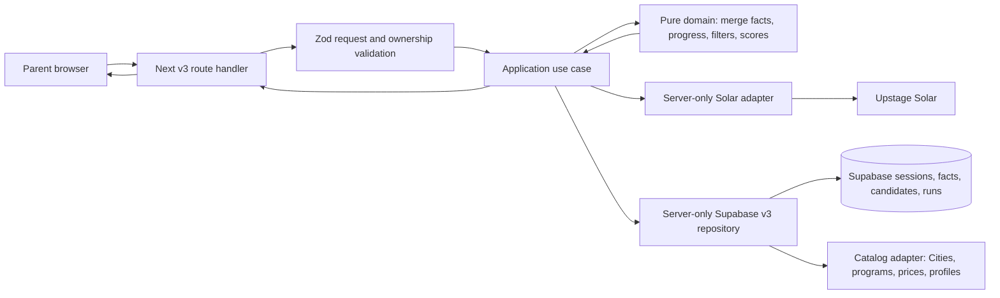

# CampFit AI v3 기술 아키텍처 결정서

- 상태: Accepted for MVP planning; implementation requires separate approval
- 기준일: 2026-07-12
- 결정: A안 — 기존 Next.js + TypeScript + Supabase를 유지하고, Upstage Solar를 server-only adapter로 추가한다.

## 1. 결정 요약

CampFit v3는 기존 앱을 재구축하지 않는다. 새 route, API, component, domain, persistence namespace를 병렬로 추가하는 방식으로 만든다.

```text
Browser UI
  → Next.js Route Handler
  → v3 application orchestration
  → pure domain rules (facts, completeness, filter, scoring)
  → server-only adapters (Solar, Supabase catalog, session repository)
  → Supabase
```

코드는 하드 필터·점수·순위의 source of truth다. Solar는 자연어를 구조화하고, 누락·충돌·질문을 제안하며, 코드가 허용한 후보와 근거 안에서 결과를 설명한다.

## 2. 현재 시스템 읽기 전용 감사

### 2.1 실제 스택

| 영역 | 현재 사실 |
|---|---|
| 프레임워크 | Next.js App Router 15.5.19, React 19.2.7 |
| 언어 | TypeScript 5.9.3, strict·`exactOptionalPropertyTypes` |
| UI | Tailwind 4.3.1, React components |
| 검증 | Zod 3.25.76 |
| DB | `@supabase/supabase-js` 2.108.2 |
| 테스트 | Vitest 2.1.8, Node 환경, `@/*` alias |
| 현재 AI | Gemini server client. Upstage/Solar 구현·env는 아직 없음 |
| 배포 설정 | `next.config.ts`에 Strict Mode와 tracing root만 있음; `vercel.json`, Dockerfile, CI workflow 없음 |

README는 Vercel 환경변수 설정을 전제로 하지만 배포 공급자는 repository에서 확정돼 있지 않다. 따라서 v3는 Next.js Node runtime을 지원하는 현재 배포 경로에 맞춰 배포하며, provider-specific 기능을 사전 가정하지 않는다.

### 2.2 route와 보존 경계

| 경로 | 현재 실제 구현 |
|---|---|
| `/` | `/campfit`으로 redirect |
| `/campfit` | `CampFitV2Flow` — 현재 기본 v2 |
| `/campfit/v2` | 동일한 `CampFitV2Flow` |
| `/campfit/legacy` | 기존 `CampfitFlow` v1/legacy |
| `/api/campfit/*` | v1 analyze, recommend, feedback |
| `/api/campfit/v2/*` | v2 session, analyze, questions, answers, recommend |

`/campfit`과 `/campfit/v2`는 공유 UI이므로 수정하면 두 경로를 동시에 바꾼다. v3 계획에서는 이 파일들과 기존 `components/campfit/*`, `components/campfit/v2/*`, `lib/campfit/v2/*`를 변경하지 않는다.

### 2.3 현재 서버·AI·DB 접근

- v2 Route Handler는 Supabase service-role client로 session, intake, natural input, AI extraction, dynamic answers, profile, recommendation run을 저장한다.
- `lib/campfit/geminiClient.ts`는 server env의 Gemini key를 읽고, 25초 timeout과 최대 3회 재시도를 가진다.
- 현재 server-only sentinel은 quality repository 일부에만 있다. `supabaseServer.ts`, Gemini client, v2 repository는 import graph상 서버 전용이지만 client import를 구조적으로 막지는 않는다.
- catalog loader는 `programs`, `program_price_options`, `campfit_program_profiles`, case-sensitive `Cities`를 읽고 일부 text inference와 local fallback을 사용한다.
- catalog 원본 DDL은 이 repository migration에 없고, 소비 계약만 adapters와 schemas에 있다.

### 2.4 v3가 그대로 재사용하지 않는 것

- v2의 긴 설문과 dynamic question bank
- v2의 10개 program mode와 v2 matching wrapper
- v2 품질 점수·backfill·shadow run
- Gemini client
- UUID만 아는 클라이언트가 API를 호출하는 session 접근 방식

shared catalog의 read-only data access pattern과 Zod·Vitest·Next Route Handler 관례는 재사용할 수 있다. v3는 shared catalog를 직접 신뢰하지 않고 v3 adapter에서 field provenance와 unknown을 다시 정규화한다.

## 3. 고려한 스택

### 3.1 비교 기준

평점은 5점이 가장 유리하다. “Python 활용 증명”은 명시적 교육·대회 요건이 없는 현재 조건에서만 평가한다.

| 기준 | 가중치 | A. 기존 Next/TS/Supabase/Upstage | B. Next UI + FastAPI + Supabase/Upstage | C. Vite + FastAPI + Supabase/Upstage |
|---|---:|---:|---:|---:|
| 기존 코드·데이터 재사용 | 20 | 5 | 3 | 1 |
| 구현 시간 | 15 | 5 | 3 | 1 |
| 마감 위험 | 15 | 5 | 3 | 1 |
| 배포 복잡도 | 10 | 5 | 2 | 1 |
| 인증·보안 경계 | 10 | 4 | 3 | 2 |
| Supabase 연동 | 10 | 5 | 4 | 4 |
| 테스트·타입 일관성 | 8 | 5 | 3 | 2 |
| 유지보수 | 5 | 5 | 3 | 2 |
| Python 활용 증명 | 4 | 1 | 5 | 5 |
| 기존 ANOGRO 통합 | 3 | 5 | 3 | 1 |
| 가중 총점 / 5 | 100 | **4.8** | **3.1** | **1.5** |

### 3.2 A안 — 기존 스택 유지

Next.js UI와 Route Handler, TypeScript domain rules, Supabase, Upstage Solar를 한 deployable application 안에 둔다.

장점:

- 현재 App Router·Tailwind·Zod·Supabase·Vitest와 data catalog를 그대로 활용한다.
- 단일 세션·auth·observability·env 경계로 운영할 수 있다.
- v1·v2를 건드리지 않는 병렬 route가 가능하다.
- 가장 빠르게 pure rules 테스트와 화면을 연결할 수 있다.

제약:

- Python을 제품 runtime에 쓰지 않는다.
- 장시간 batch 평가나 복잡한 ML 파이프라인이 생기면 별도 worker 판단이 필요하다.

### 3.3 B안 — Next UI + FastAPI AI service

Next는 UI, FastAPI는 상담 orchestration과 Solar 호출을 담당한다.

장점:

- Python을 명시적으로 보여줄 수 있다.
- 장시간 평가 worker, 독립 AI scaling이 필요해지면 서비스 경계가 명확하다.

비용과 위험:

- auth, cookie, CSRF, rate limit, OpenAPI contract, logging, secret, deploy, monitoring이 두 runtime에 중복된다.
- TypeScript UI와 Python AI contract의 schema drift 가능성이 생긴다.
- 새 service deployment 실패가 상담 전체를 막는다.

명시적인 Python 산출물 요구, 독립 장시간 worker, 또는 별도 AI team이 확정되기 전에는 선택하지 않는다.

### 3.4 C안 — React Vite + FastAPI 재구축

장점은 Python 중심 구성이지만, 기존 Next routes·UI·배포·integration을 버리고 새 auth와 routing을 다시 만든다. v3 MVP의 범위와 마감에 비해 위험이 가장 크므로 채택하지 않는다.

## 4. 권장 아키텍처

### 4.1 route와 API 제안

승인 후에만 아래 경로를 새로 만든다.

| 목적 | 제안 경로 |
|---|---|
| 시작 | `/campfit/v3` |
| 상담 | `/campfit/v3/consult` |
| 결과 | `/campfit/v3/result` |
| 세션 생성·재개 | `/api/campfit/v3/session` |
| 대화 turn 처리 | `/api/campfit/v3/message` |
| fact 수정 | `/api/campfit/v3/facts` |
| 추천 실행 | `/api/campfit/v3/recommendations` |

결과 session ID는 URL path/query의 권한 토큰으로 쓰지 않는다. server-side opaque session과 signed HttpOnly cookie로 연결한다.

### 4.2 권장 파일 경계

```text
app/campfit/v3/*                     route-level pages only
app/api/campfit/v3/*                 request validation and response mapping
components/campfit/v3/*              UI and client state only
types/campfitV3.ts                   public TypeScript contracts
lib/campfit/v3/domain/*              pure facts, completeness, filters, scoring, tests
lib/campfit/v3/application/*         process turn and recommendation orchestration
lib/campfit/v3/server/env.ts         server-only environment validation
lib/campfit/v3/server/upstageClient.ts
lib/campfit/v3/server/sessionRepository.ts
lib/campfit/v3/server/catalogRepository.ts
lib/campfit/v3/server/supabaseV3Repository.ts
```

`domain`은 browser tests와 CLI/evaluation에서 import할 수 있는 pure TypeScript다. `server/*`에는 모두 `import "server-only"`를 넣고, UI와 pure domain에서 import하지 않는다. CLI가 필요한 경우 `domain` contracts와 별도의 CLI Supabase adapter만 import한다. Next server-only repository를 CLI에서 직접 import하지 않는다.

### 4.3 data flow



Solar never gets a direct DB credential, a write tool, or an unbounded candidate set. The application layer sends only the current message, normalized state, allowed next keys, and allowed candidate facts.

### 4.4 Upstage Solar 호출 위치와 contract

`lib/campfit/v3/server/upstageClient.ts`가 Upstage 호출의 단일 위치다.

- 환경변수: `UPSTAGE_API_KEY`, `UPSTAGE_MODEL`을 server-only validation에서 읽는다.
- endpoint·payload 세부사항은 구현 직전 공식 Upstage 문서로 검증한다. 이 ADR는 특정 endpoint나 model ID를 하드코딩하지 않는다.
- application layer는 `SolarConsultationPort` interface에 의존하고 실제 HTTP client는 주입한다.
- timeout, 429/5xx 재시도, jitter, circuit breaker, request ID를 adapter에 둔다.
- structured output은 strict Zod schema로 parse한다. 1회 repair 후 실패하면 deterministic fallback으로 전환한다.
- model output의 `readyForRecommendation`은 힌트일 뿐이며 domain 규칙이 재검증한다.

### 4.5 persistence 제안

기존 v1·v2 테이블을 재사용·변형하지 않고 additive v3 tables를 사용한다.

| 테이블 | 목적 |
|---|---|
| `campfit_v3_sessions` | opaque session, ownership binding, status, active turn, consent |
| `campfit_v3_messages` | raw user/assistant message와 turn 순서 |
| `campfit_v3_facts` | active/replaced fact, subject, value, source, confidence, evidence, revision |
| `campfit_v3_conflicts` | unresolved·conflict 상태와 해결 이력 |
| `campfit_v3_recommendation_runs` | algorithm/model version, candidate snapshot, score breakdown, report |
| `campfit_v3_audit_events` | safe operational audit; raw message duplicate 금지 |
| `campfit_v3_city_facts` | v3 도시 차원, evidence, verification date, confidence |

`programs`, `program_price_options`, `campfit_program_profiles`, `Cities`는 read-only input이다. v3가 필요한 정규화·출처·unknown 사실은 v3 tables에 append한다.

## 5. 인증·보안·운영 설계

### 5.1 현 상태에서 보완할 위험

현재 v2 API는 UUID session ID를 입력받고 service-role로 DB를 다루며, auth ownership, Origin/CSRF, rate limit, payload length 방어가 충분하지 않다. v3는 같은 경계를 복제하지 않는다.

### 5.2 v3 minimum controls

- signed HttpOnly, Secure, SameSite anonymous session cookie 또는 로그인 user ownership
- 모든 요청의 session ownership, optimistic turn version, idempotency key 검증
- same-origin/CSRF policy, IP+session rate limit, body·message·array 길이 제한
- Supabase service role은 Route Handler와 `server/*` adapter 안에서만 사용
- RLS는 service-role-only 또는 user/session ownership model을 명시하고 public direct table access를 금지
- prompt injection: 사용자 원문을 data로 구획, model에 tool 권한 미부여, strict parse, candidate/evidence recheck
- raw transcript·special care에 대한 동의, retention, delete mechanism, redacted logs
- analytics raw text 금지, secret·전체 Supabase URL 출력 금지
- stale turn·double submit 방지와 서버 측 idempotent write

## 6. 배포와 관측성

### 6.1 배포 구조

기존 Next app과 같은 Node runtime에 v3 Route Handler를 배포한다. 별도 FastAPI/Vite 배포는 만들지 않는다. 배포 공급자가 확정되기 전에는 Next-compatible 환경의 timeout, env secret, server egress, log redaction 지원 여부를 release gate로 확인한다.

필수 server env는 다음과 같다.

```text
NEXT_PUBLIC_SUPABASE_URL
SUPABASE_SERVICE_ROLE_KEY
UPSTAGE_API_KEY
UPSTAGE_MODEL
```

`NEXT_PUBLIC_` 접두사가 없는 Solar key와 service-role key는 client code, build output, error payload에 포함되면 안 된다.

### 6.2 관측성

- request ID, session hash, turn number, model call latency, retry count, schema failure category
- recommendation algorithm version, snapshot hash, candidate count, limited-result flag
- 운영 로그는 raw transcript와 special care evidence를 기본적으로 마스킹
- model failure, parse failure, catalog drift, ownership rejection, rate-limit rejection을 별도 metric으로 기록

## 7. v1·v2 보존과 rollout

1. v3는 `/campfit/v3`에서만 개발·검증한다.
2. `/campfit`, `/campfit/v2`, `/campfit/legacy`, 기존 API와 table은 변경하지 않는다.
3. v3 feature flag `CAMPFIT_V3_ENABLED`이 false면 v3 route에서 안전한 비활성 안내만 제공한다.
4. 검토와 QA가 끝나도 `/campfit`의 기본 대상을 바꾸는 일은 별도 승인으로 분리한다.
5. shared catalog adapter 변경은 v1·v2 회귀검증을 통과할 때만 별도 PR로 한다.

## 8. 개발 단계

| 단계 | 산출물 | 완료 게이트 |
|---|---|---|
| 0. 문서·데이터 승인 | PRD, ADR, 도시 우선순위, privacy 결정 | 이 문서의 3개 open decision 승인 |
| 1. pure domain | v3 contracts, 11-slot progress, filters, scores, test fixtures | 25개 정확도 사례·알고리즘 tests 통과 |
| 2. data readiness | v3 adapters, city/program fact 보강 계획, dry-run | DB write 전 schema·sample review |
| 3. server application | session ownership, turn processing, Solar adapter, fallback | schema, retry, security, resume tests 통과 |
| 4. UI | start, intake, chat, loading, result, responsive QA | page acceptance criteria 통과 |
| 5. pilot | controlled data, audit, demo run | no hallucinated candidates, no secret leakage, v1/v2 regression 없음 |

이 문서 작성 작업은 0단계만 완료한다. 코드·migration·DB write는 포함하지 않는다.

## 9. rollback 전략

- v3는 additive route와 additive tables만 사용한다. 기존 v1·v2 data migration이나 default route 교체를 하지 않는다.
- 기능 문제 시 `CAMPFIT_V3_ENABLED=false`로 v3 진입을 비활성화하고 `/campfit`은 계속 v2를 제공한다.
- deployment rollback은 직전 Next build로 되돌리되, v3 session·audit record는 삭제하지 않는다.
- Solar 오류 시 마지막 성공 state와 deterministic fallback을 사용하고, 추천 결과 생성 실패는 재시도 가능한 상담 상태로 남긴다.
- catalog data drift 시 해당 candidate를 `unknown` 또는 hold로 전환하고, AI가 대체 후보를 만들어내지 못하게 한다.
- algorithm version을 변경해도 기존 run은 snapshot과 version으로 재현한다.

## 10. 재검토 조건

다음 중 하나가 확정되면 B안을 다시 평가한다.

- 대회·교육에서 Python service 구현이 명시적 필수 조건이 됨
- Solar evaluation·batch processing이 Next request lifecycle을 지속적으로 초과함
- 독립 AI worker team과 observability/secret/deploy 운영 책임이 생김

그 외에는 A안의 단일 TypeScript domain과 server-only adapter가 일정·보안·유지보수 면에서 적합하다.
